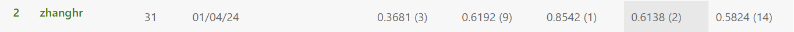
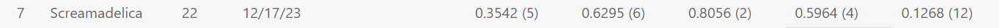

# Digital-Image-Processing-Project
**数字图像处理 project：高血压视网膜病变图像的分类**

> *详细的项目记录、文件功能描述、命令行参数等内容请见 [RECORD](RECORD.md)*

## 项目介绍
心血管疾病一直是导致全球死亡的主要原因之一，其中高血压是一个重要的危险因素。为了早期检测和识别高血压，本小组开发了一个辅助系统，利用深度学习算法对高血压引起的视网膜损伤（高血压视网膜病变）进行自动诊断。本小组预选多个网络模型进行分类训练，最终选出 ResNet 和 DenseNet 作为 Backbone 来进一步优化性能。本小组通过数据增强、迁移学习、交叉验证、集成学习等方法，克服了训练过程中的种种困难，提高了模型的泛化能力，解决了数据集不足导致的过拟合问题，最终在比赛网站测试集上获得了`0.6138`的得分。

## 环境
详细环境见requirements.txt。主要环境为
- `cuda11.8`
- `python3.7`
- `pytorch2.1.0`

## 文件说明
- `scripts/` 运行脚本所在文件夹
- `network/` 模型代码所在文件夹
- `src/` 
  - `src/data.py` 实现数据读取等功能
  - `src/transform.py` 实现数据预处理、数据增强等功能
  - `src/utils.py` 实现了一些杂项功能，如保存模型参数、训练结果等
  - `src/train.py` **实现了模型训练功能**
- `visual/` 
  - `visual/show_result.py` 实现训练结果的转换和可视化
  - `visual/visual.py` 获得转换过后的样例图片
- `upload_dir/` 模型训练完毕后，用于测试提交的缓冲区

## 项目运行

### 训练模型
运行以下命令，训练模型。运行脚本中的参数需要根据情况修改。
```shell
# Linux
bash scripts/train.sh

# Windows
scripts/train.bat
```

### 可视化
运行以下命令生成样例图片。在运行前，请正确设置合适的参数。
```shell
# Linux
bash scripts/visual.sh

# Windows
scripts/visual.bat
```

运行以下命令根据`.csv`结果文件获取可视化数据。
```shell
# Linux
bash scripts/show_result.sh

# Windows
scripts/show_result.bat
```

## 项目结果
- 使用多模型集成：`0.6138`

- 运用数据增强、交叉验证、迁移学习的 DenseNet121：`0.5964`

