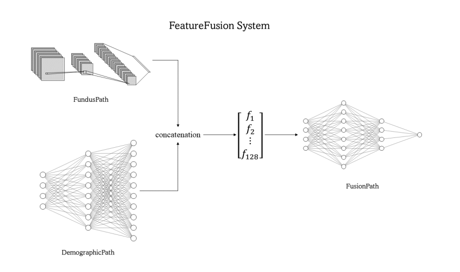

# Digital-Image-Processing-Project
**数字图像处理 project：高血压视网膜病变图像的分类**

### 评估并上传模型步骤

#### *务必在 `upload_dir` 中运行 `eval_model.py` ，得到合适的结果之后再提交！*
- 由于`transform.py`可能不同，**将自己的`transform.py`替换掉`upload_dir/transform.py`文件**
- 将模型权重文件复制到`upload_dir`下，并改名成`Net.pth`
- 将网络定义文件复制到`upload_dir`下，并改名成`Net.py`
- 打开`./upload_dir/model.py`文件，添加 **`from Net import xxx`** ，其中 **xxx** 是`Net.py`文件中的模型类名，并设置参数:
  - `net`: **`Net.py`文件中的模型类名**
  - `num_classes`: 模型最后一层输出的形状，`1`或`2`
  - `ckpt_path`: 权重文件名，默认为`Net.pth`
  - `transform_method_origin`: 读取数据时所用的预处理方法编号
  - `threshold`: `num_classes = 1`时，所使用的的`threshold`，范围在 $0\sim 1$ 之间
- 打开`./upload_dir/eval_model.py`文件，根据任务修改`task`编号
- 进入文件夹`upload_dir`，运行命令
```bash
python eval_model.py
```
- 如果运行成功，将会输出模型在整个数据集的结果，否则就需要先 **debug**
- 将`upload_dir`文件夹中的`model.py`，`transform.py`，`Net.py`，`Net.pth`，`metadata`五个文件打包成`upload_1.zip`，其中的`1`代表第1次提交
- 打开[提交网站](https://codalab.lisn.upsaclay.fr/competitions/11877#participate)
- 在 **Particapate** 中的 **Submit / View Results** 板块下，点击 **Future Test Phase - Task 1** ，进行提交（如果是task2，就选择 **Future Test Phase - Task 2**)

### 文件结构

1. `./dataset/` 数据集，**需要在本地放置数据集**
2. `./network/` 网络模型
3. `./results/` 训练后生成，保存训练结果的`.csv`文件，**不会上传至github，需要另外保存**
4. `./checkpoints/` 训练后生成，保存训练时的模型参数，为`.pth`文件，**不会上传至github，需要另外保存**
5. `./checkpoints_load/` 训练一次后生成，用于放入训练前加载的模型参数文件，**不会上传至github**
6. `./upload_dir/` 用于测试和提交模型的文件夹
7. `data.py` 数据读取和处理
8. `transform.py` 数据预处理
9. `utils.py` 包含了一些功能型函数
10. `train.py` 训练模型
11. `train.bat` *windows* 运行脚本
12. `train.sh` *linux* 运行脚本
13. `model.py` 用于在测试集上评估模型的模型文件
14. `eval_model.py` 模拟在测试集上对模型进行评估（实际使用了训练集）
15. `./visual/` 用于存放数据集可视化之后的图片，**不会上传至github，需要另外保存**
16. `visual.py` 用于批量可视化数据集
17. `visual.bat` 运行`visual.py`的*windows*脚本
18. `visual.sh` 运行`visual.py`的*linux*脚本

### 注意事项

1. 运行前，先将数据集放在`./dataset`文件夹下，如`./dataset/1-Hypertensive Classification`，以及`./dataset/2-Hypertensive Retinopathy Classification`。
2. 最终保存下来的`.pth`模型权重文件位于`./checkpoints`文件夹中。`./checkpoints`文件夹不会被上传至github，需要另外保存。
3. 结果数据保存在`./results/`中，该文件夹不会被上传至github，需要另外保存。
4. 每次训练完毕，都会在主文件夹中生成`results.png`用于可视化训练过程。
5. 神经网络调用时，要求接收一个参数`num_classes`，用于调整最后输出的大小。

### 环境
本项目在`requirements.txt`所示环境中能够运行。

### Tensorboard可视化使用方法

- *在本地运行*
  - 在主文件夹中输入命令：`cd log/task-1/TestNet`。
  - 然后输入命令：`tensorboard --logdir ./ --port 8099`。
  - 在**本地**打开命令行出现的网址，即`http://localhost:8099/`。

- *在服务器上运行*
  - 在主文件夹中输入命令：`cd log/task-1/TestNet`。
  - 因为默认使用`/root/tf-logs`作为`logdir`，所以需要执行命令`ps -ef | grep tensorboard | awk '{print $2}' | xargs kill -9`删除该进程。
  - 然后输入命令：`tensorboard --logdir ./ --port 6007`。
  - 在`AutoPanel`中打开`Tensorboard`。

**注意**：
- 在网站中，将右上角设置中的`reload_data`打上勾，可自动刷新网站
- 每次训练时，需要将以前的数据文件`events.out. ...`删除，按下`Ctrl+C`退出`Tensorboard`进程并重新运行命令，才能正确加载当前训练的数据。此过程中网站不需要关闭，`tensorboard`设置也不会重置。

### 可视化数据集
使用下列命令来查看命令行参数信息。
```bash
python visual.py -h
```
运行脚本，生成图片。
```bash
visual.bat
# or
bash visual.sh
```

### 命令行参数
- *base parameters*:
  - `task`: 任务数字，`1`或`2`
  - `seed`: 随机种子编号。在超参数不变的情况下，seed设置相同，那么结果就会一模一样，如果seed设置不同，结果就会不同
  - `device`: 设备，`cuda`或`cpu`
  - `data_dir`: 数据集存放路径
- *optimization parameters*:
  - `n_valid`: 验证集样本个数
  - `transform_method_origin`: 读取数据时所用的预处理方法编号
  - `transform_method_epoch`: 训练时对训练数据进行的随机性预处理方法编号
  - `batch_size`: 每个轮次训练时的批大小
  - `n_epochs`: 轮次次数
  - `is_shuffle`: 是否在读取数据、划分训练集/验证集时进行随机打乱
- *optimizer parameters*:
  - `optimizer`: 优化器，默认有两种选择,adam与sgd
  - `lr`: 学习率
  - `lr_decay_epochs`: 学习率发生改变的对应轮次，可以添加多个轮次数值
  - `lr_decay_values`: 学习率发生改变的目标数值，可以添加多个学习率数值
  - `weight_decay`: adam优化器的正则化参数，用于调整网络的敏感程度，越大，敏感程度越小
  - `betas`: adam优化器的衰减因子，有两个，默认为`(0.9, 0.999)`
  - `momentum`: SGD优化器的动量参数,默认为`0.9`
- *model parameters*:
  - `out_dim`: 网络最后一层输出的形状，`1`或`2`
  - `threshold`: `out_dim`为`1`时，划分正负样本的边界，默认为0.5
  - `model`: 模型名称
  - `is_search`: `out_dim`为`1`时，是否在最佳模型权重上搜索`threshold`
- *logging parameters*:
  - `ckpt_dir`: 保存模型权重的路径
  - `result_dir`: 保存训练结果+命令行参数设置
  - `ckpt_every`: 每多少个epoch保存一次模型权重
  - `eval_every`: 每多少个epoch进行一次训练集和验证集loss和score的评估，打印并保存到results中
  - `print_every`: 每个epoch中，每多少个batch进行一次训练集上loss的打印
- *pretrain parameters*:
  - `pretrained`: 
    - 为`0`表示不进行预训练
    - 为`1`表示在声明模型时，传入参数`pretrained=True`，否则`pretrained=False`
    - 为`2`表示加载`ckpt_load_dir/model/ckpt_load_name.pth`模型参数文件 (如`checkpoint_load/resnet18/pre.pth`)
  - `ckpt_load_dir`: 用于加载模型参数的文件夹
  - `ckpt_load_name`: 用于加载的模型参数文件名

### 预处理
1. xxx

## 论文

- [Classification of Diabetic Retinopathy Images by Using Deep Learning Models](https://www.researchgate.net/publication/322978904_Classification_of_Diabetic_Retinopathy_Images_by_Using_Deep_Learning_Models?enrichId=rgreq-20fcda6f3c75365a3fc74c0264a0fe45-XXX&enrichSource=Y292ZXJQYWdlOzMyMjk3ODkwNDtBUzo2MzczNzgxMDg2MTI2MDhAMTUyODk3NDE5MTM4Mg%3D%3D&el=1_x_3&_esc=publicationCoverPdf) 介绍的一些形态学预处理方法可以借鉴

- [HyMNet: a Multimodal Deep Learning System for Hypertension Classification using Fundus Photographs and Cardiometabolic Risk Factors](https://paperswithcode.com/paper/hymnet-a-multimodal-deep-learning-system-for) 需要额外的参数，但是思路可以参考

论文的主要思路：

预处理：裁剪，resize，normalize

数据增强：旋转，翻转，模糊（使用卷积核大小为5的Gaussian blur）

HyMNet由FundusPath, DemographicPath, FusionPath组成，其大体结构如下图所示

FundusPath负责处理眼底图像（也就是我们的网络现在在进行的工作），其使用DenseNet201

DemographicPath负责处理年龄和性别特征，其使用Fully Connected Neural Network

FusionPath负责综合上述两个模态



- [Hypertensive Retinopathy Screening through Fundus Images-A Review](https://ieeexplore.ieee.org/document/9358746)
   
综述，提到了一些前人的工作，以及“然而，对于医学影像的筛查，这些结构的分类性能可能也无关紧要。医学图像数据集可能是原因之一，因为特定领域的数据集有限，可能导致模型过度拟合或欠拟合。此外，迁移学习和超参数调优可以在现有数据集和网络上实现，用于特定应用，具有更多的加权参数来提取中间特征。”

包括以下HR的五大特征(可以考虑进行特征提取)


- [Machine learning algorithms for hypertensive retinopathy detection through retinal fundus images](https://books.google.com.tw/books?hl=zh-CN&lr=&id=7X9ZEAAAQBAJ&oi=fnd&pg=PT55&dq=hypertension+detection+by+fundus&ots=GUs64sMYYq&sig=6dOdufN-gGPgLE_jSLTihAdIm-0&redir_esc=y#v=onepage&q=hypertension%20detection%20by%20fundus&f=false)
介绍了两大HR分类的方法，卷积网络VS机器学习 供参考


## 数据集
1. [全球94个开放获取数据库特征——《全球眼科图像公开数据库使用指南（2022）》附表](http://www.ykxjz.com/docs/tzgg/details.aspx?documentid=54&Nid=A967CBAD-BC53-4787-88ED-CD9D9ABAA7DE)

### 记录

- *v0.1*
  - *v0.1.0* 
    - 建立项目
- *v0.2* 
  - *v0.2.0*
    - 完成数据读取，数据预处理，训练功能
  - *v0.2.1*
    - 完善代码并添加`utils.py`文件。
- *v0.3*
  - *v0.3.0*
    - 添加`DenseNet`和`ResNet`网络代码
    - 添加`is_search`命令行参数，完善代码
    - 删除了github上的results文件夹，改为本地保存
  - *v0.3.1*
    - 添加`transform_method_origin`和`transform_method_epoch`命令行参数，用于在训练时引入数据增强功能
    - 修复一些小bug
    - 将最终结果保存成图片文件`results.png`，方便查看训练结果
    - 在训练时，不仅会打印`score`和`loss`，还会打印训练和验证集的`TP`，`TN`，`FP`，`FN`。
  - *v0.3.2*
    - 添加`out_dim`命令行参数，用于控制输出大小，为`1`输出大小为`[batch_size, 1]`，为`2`输出大小为`[batch_size, 2]`。如果为`1`，使用神经网络输出值经过`sigmoid`所得作为正样本概率；如果为`2`，使用神经网络输出的两个值分别作为负样本、正样本概率。
  - *v0.3.3*
    - 在`README.md`中添加对命令行参数的详细中文解释
    - 修改了一些命令行参数的数据类型
- *v0.4*
  - *v0.4.0*
    - 完成`model.py`和`eval_model.py`文件
    - 在`data.py`中添加`n_valid`为`0`时的特殊情况
    - 删除`net_test.py`中`TestNet`中不必要的模型参数，防止在保存和加载模型参数时出错
    - 将`train.py`中计算分数的函数移至`utils.py`中
    - `utils/cal_scores`汇总结果时，添加`losses`为`None`的情况
    - 修改`README.md`
- *v0.5*
  - *v0.5.0*
    - 完成`visual.py`文件，用于可视化数据集，方便查看图像、对应 label 及图像名
  - *v0.5.1*
    - 添加`README.md`中的预处理、论文、数据集部分。
  - *v0.5.2*
    - 在命令行参数中添加`Adam`的`betas`和`SGD`的`momentum`参数
    - 在`README.md`中添加测试并提交文件的指引
    - 添加新的自定义网络`SResNet`
  - *v0.5.3*
    - 修复`out_dim = 1`或者是`num_classes = 1`时`eval_model`运行结果错误的问题
  - *v0.5.4*
    - 在`transform.py`中添加旋转的数据增强操作和去除高亮点的数据预处理方法。添加旋转的数据增强操作能够有效避免过拟合！
    - 更新论文
- *v0.6*
  - *v0.6.0*
    - 添加`tensorboard`可视化的支持，具体的可视化文件夹位于`./log`下，使用`tensorboard`的方法在`README.md`中
    - 更改模型参数的保存：在训练时，不仅保存 loss 最小的模型参数，还会保存 average score 最大的模型参数
  - *v0.6.1*
    - 添加`UNet.py`，添加`report/`文件夹，图片、文件、报告都可以放在这个文件夹下
    - 添加`requirements.txt`
    - 修改`UNet.py`为`AUNet.py`
  - *v0.6.2*
    - 在`README.md`中更新了两篇文献
    - 添加`VGGNet`
  - *v0.6.3*
    - 让`train.py`和`data.py`支持task2的数据集读取和训练
    - `train.py`使用模型时，加入`in_channel`的传入参数，具体为：
    ``` python
    in_channel = train_data[0]['image'].shape[0]
    net = getattr(network, args.model)(num_classes=args.out_dim, in_channel=in_channel)
    ```
    - `visual.py`加入测试`transform`的功能，并增加调节生成图片个数的命令行参数
    - `transform.py`增加新的预处理功能，`method_3/4/5`
    - `DenseNet.py`新增4个不同深度的网络结构，也可自己改动
  - *v0.7.0*
    - 添加新的命令行参数，用于加载预训练模型，具体解释请见命令行参数部分
    - 修改*resnet18/34/50/101*的相关代码，用于加载官方预训练模型
    - 现在的模型都要求有三个传入参数了: `num_classes`, `in_channel`, `pretrained`